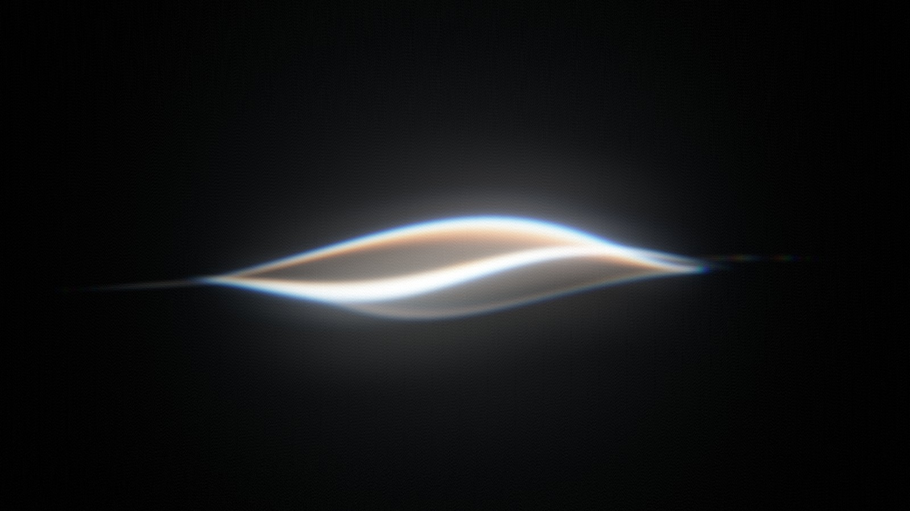

# Light Ribbon

A glowing, twisted ribbon of light, rendered in real time in the browser with [Three.js](https://threejs.org).

The ribbon is a thin 3D strip that twists, waves and tapers to sharp points at both ends. Its edges catch the light and split into cool and warm colours. Bloom, a soft blur, chromatic aberration and film grain are applied as post-processing, so the result reads as light rather than as geometry.

Every value can be changed live from the control panel.

## Run it

It is a single HTML file with no build step.

- **Locally:** open `index.html` in a modern browser (Chrome, Edge, Firefox or Safari with WebGL 2). If your browser blocks it when opened from disk, start a small local server in this folder, for example `npx serve .` or `python3 -m http.server`, and open the address it prints.
- **GitHub Pages:** push this folder to a repository, then go to *Settings → Pages* and publish from the branch root. The page will be live at `https://<your-user>.github.io/<repo>/`.

Three.js and lil-gui are loaded from the jsDelivr CDN, so an internet connection is needed the first time the page loads.

## Controls

The panel in the top-right corner has four groups:

| Group | What it changes |
| --- | --- |
| **Shape** | Length, width, tip taper, twist and its speed, wave amplitude, frequency and speed, 3D tilt, leaf lean, rotation, belly offset, vertical position |
| **Light & color** | Ribbon colour and brightness, lower-half brightness, fold sharpness and brightness, edge width, brightness and colours (cool / warm), lower-edge brightness, inner strand, hairline tails |
| **Post-processing** | Bloom strength, radius and threshold, blur, chromatic aberration, exposure, grain, background |
| **Pause** | Freezes the animation |

## How it works

1. **Geometry on the GPU.** A dense plane (480 × 32 segments) is passed to a custom vertex shader. The shader rebuilds every vertex as a point on a twisted, waving strip. A `sin(πu)^taper` envelope makes the width go to zero at both tips, and a shear term leans the leaf shape. Normals come from finite differences of the same function.
2. **Light, not surface.** The fragment shader draws the ribbon with additive blending:
   - a dim, translucent body that is brighter where the strip faces the camera;
   - a bright fold where the strip turns edge-on;
   - thin rims along both edges, going from a cool colour outside, through white, to a warm colour inside.
3. **Extra layers.** A narrower, slanted inner strand gives the bright diagonal core. Very thin tails run past both tips.
4. **Post-processing chain.** `RenderPass → UnrealBloomPass → separable Gaussian blur (horizontal + vertical) → OutputPass (ACES tone mapping, sRGB) → final pass (chromatic aberration, grain, background, vignette)`. Grain and the background tone are added after tone mapping, in display space, so the blacks stay clean.

## Tech

- [Three.js](https://github.com/mrdoob/three.js) r170 (WebGL 2, `EffectComposer`, `UnrealBloomPass`, `ShaderPass`, `OutputPass`)
- [lil-gui](https://github.com/georgealways/lil-gui) 0.19 for the control panel
- Custom GLSL vertex and fragment shaders

## Credits and licence

Code: © 2026 Marcin Kwiatkowski, released under the [MIT License](LICENSE).

Third-party libraries keep their own licences. See [THIRD_PARTY_NOTICES.md](THIRD_PARTY_NOTICES.md).

This is an independent project, inspired by the soft light effects in modern voice-assistant interfaces. It is not affiliated with, endorsed by or connected to any company or product.
